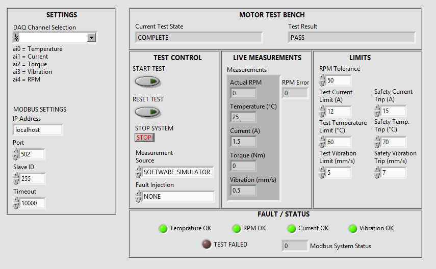
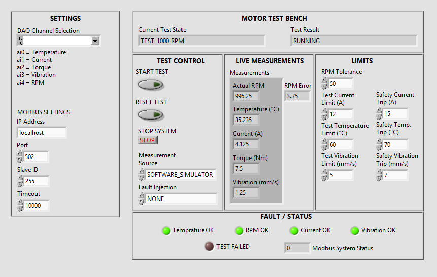
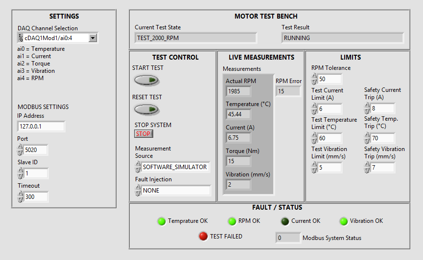
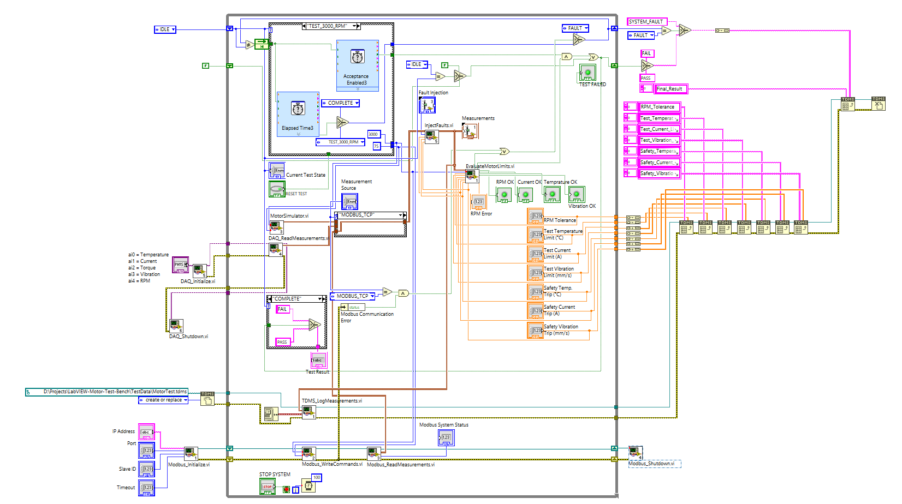
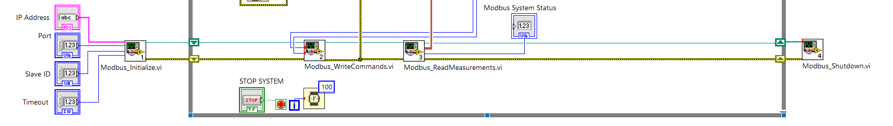
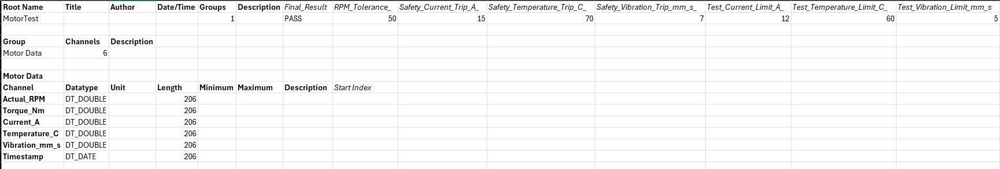
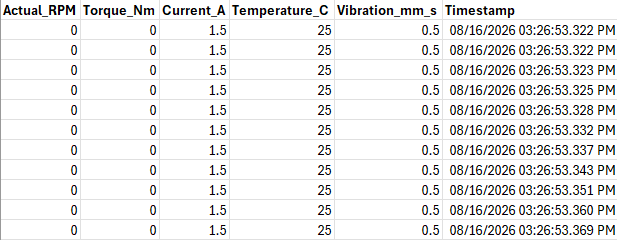

# Automated Electric Motor Test Bench

A LabVIEW-based automated motor test bench built as a portfolio project to demonstrate test automation, NI-DAQmx acquisition, Modbus TCP communication, fault handling, safety monitoring, and TDMS logging.

The application executes a multi-stage motor test sequence, acquires measurements from one of three interchangeable sources, evaluates acceptance and safety criteria, handles faults, and records test data and metadata for later review.

## Highlights

- LabVIEW state-machine test executive
- Automated 1000, 2000, and 3000 RPM test stages
- Configurable load commands and acceptance limits
- Three interchangeable measurement sources:
  - software motor simulator
  - NI-DAQmx with simulated NI cDAQ hardware
  - Modbus TCP virtual motor controller
- Modbus TCP command and measurement exchange
- Separate acceptance-failure and safety-trip logic
- Communication-loss detection
- Controlled fault injection
- TDMS measurement and metadata logging
- Test-failure latching and automatic FAULT transition
- State-entry timer reset and measurement-settling logic
- Operator-oriented HMI

## Demo

### Normal test completion



### Test running



### Failed test / fault indication



## Automated Test Sequence

```text
IDLE
  |
  v
TEST_1000_RPM     1000 RPM / 25% load
  |
  v
TEST_2000_RPM     2000 RPM / 50% load
  |
  v
TEST_3000_RPM     3000 RPM / 75% load
  |
  v
COMPLETE
```

Each active test stage runs for approximately five seconds. A short settling period is applied after each setpoint change before acceptance criteria are allowed to latch a test failure. Safety monitoring remains active during that settling period.

## Architecture

```text
                         MotorTestBench_Main.vi
                                  |
             +--------------------+--------------------+
             |                    |                    |
             v                    v                    v
       State Machine       Measurement Source      Test Controls
                                  |
                   +--------------+--------------+
                   |              |              |
                   v              v              v
            MotorSimulator     NI-DAQmx       Modbus TCP
                   |              |              |
                   +--------------+--------------+
                                  |
                                  v
                         MotorMeasurements.ctl
                                  |
                                  v
                           InjectFaults.vi
                                  |
                                  v
                      EvaluateMotorLimits.vi
                                  |
                    +-------------+-------------+
                    |             |             |
                    v             v             v
                   HMI        TDMS Logging   Fault Handling
```

The application uses a common `MotorMeasurements.ctl` typedef so downstream logic does not need to know whether the data came from software simulation, DAQmx, or Modbus TCP.

### Main LabVIEW block diagram



## Measurement Channels

The common measurement cluster contains:

- Actual RPM
- Torque (Nm)
- Current (A)
- Temperature (°C)
- Vibration (mm/s)

## NI-DAQmx Acquisition

The DAQ subsystem uses explicit initialization, acquisition, and shutdown VIs:

- `DAQ_Initialize.vi`
- `DAQ_ReadMeasurements.vi`
- `SensorScaling.vi`
- `DAQ_Shutdown.vi`

Development was performed with simulated NI hardware in NI MAX:

- NI cDAQ-9174 chassis
- NI 9205 analog-input module
- channels `ai0:4`

Channel mapping used by the project:

| Channel | Measurement |
|---|---|
| ai0 | Temperature |
| ai1 | Current |
| ai2 | Torque |
| ai3 | Vibration |
| ai4 | RPM |

The sensor transfer functions used here are simplified software mappings for test-automation development, not calibrated physical sensor models.

**Physical NI hardware commissioning was not performed in this project.**

## Modbus TCP

The Modbus path consists of:

- `Modbus_Initialize.vi`
- `Modbus_WriteCommands.vi`
- `Modbus_ReadMeasurements.vi`
- `Modbus_Shutdown.vi`

LabVIEW maintains the Modbus session across the main loop, writes command registers, and reads measurement registers from a Python-based virtual motor controller.

Development connection:

```text
IP Address : 127.0.0.1
Port       : 5020
Device ID  : 1
```

### Register map

| Address | Signal |
|---:|---|
| 0 | Commanded RPM |
| 1 | Load % |
| 2 | Actual RPM |
| 3 | Current x10 |
| 4 | Temperature x10 |
| 5 | Torque x10 |
| 6 | Vibration x10 |
| 7 | System Status |

Values with `x10` scaling are transported as integer Modbus registers and converted back to engineering values in LabVIEW.

### Modbus implementation



### Virtual controller

The virtual controller is implemented in Python using PyModbus:

```text
ModbusSimulator/
  modbus_motor_server.py
  requirements.txt
```

The server accepts commanded RPM and load, calculates simplified motor measurements, and exposes them through the Modbus register map.

Install the Python dependency with:

```powershell
cd ModbusSimulator
python -m venv .venv
.\.venv\Scripts\python.exe -m pip install -r requirements.txt
```

Run the virtual controller with:

```powershell
.\.venv\Scripts\python.exe modbus_motor_server.py
```

## Safety and Acceptance Logic

Acceptance failures and system safety trips are intentionally separated.

Acceptance checks include RPM error and configurable current, temperature, and vibration test limits. An acceptance violation can latch `TEST FAILED` while allowing the test executive to continue.

Safety conditions cause the state machine to enter `FAULT` and command RPM/load to zero. Safety handling includes:

- overcurrent
- overtemperature
- excessive vibration
- RPM sensor failure injection
- Modbus communication loss

The safety path remains active during the post-transition settling period.

## Fault Injection

`InjectFaults.vi` supports controlled test scenarios through `FaultInjectionMode.ctl`:

- `NONE`
- `OVERCURRENT`
- `OVERTEMPERATURE`
- `HIGH_VIBRATION`
- `RPM_SENSOR_FAILURE`

This allows safety behavior to be validated without physical motor hardware.

## TDMS Logging

`TDMS_LogMeasurements.vi` logs the following channels under the motor-data group:

- `Actual_RPM`
- `Torque_Nm`
- `Current_A`
- `Temperature_C`
- `Vibration_mm_s`
- `Timestamp`

The application also stores test configuration and final-result metadata as TDMS properties.

### TDMS metadata example



### TDMS data example



## Validation

The repository contains a documented validation matrix in [`VALIDATION.md`](VALIDATION.md).

Validated scenarios include:

- full software-simulator test sequence
- full Modbus TCP test sequence
- overcurrent safety trip
- overtemperature safety trip
- excessive-vibration safety trip
- RPM sensor failure
- Modbus communication loss
- repeated test execution with timer reset
- Modbus transition settling without false RPM-failure latching

## Key Project Files

```text
MotorTestBench.lvproj
MotorTestBench_Main.vi

MotorSimulator.vi
MotorMeasurements.ctl

DAQ_Initialize.vi
DAQ_ReadMeasurements.vi
DAQ_Shutdown.vi
SensorScaling.vi

Modbus_Initialize.vi
Modbus_WriteCommands.vi
Modbus_ReadMeasurements.vi
Modbus_Shutdown.vi
ModbusRegister.ctl

EvaluateMotorLimits.vi
InjectFaults.vi
FaultInjectionMode.ctl

TDMS_LogMeasurements.vi

ModbusSimulator/
TestEvidence/
VALIDATION.md
```

## Technologies

- LabVIEW Community Edition
- NI-DAQmx
- NI MAX
- simulated NI cDAQ-9174 / NI 9205
- Modbus TCP
- Plasmionique Modbus Master
- Python
- PyModbus
- TDMS
- Git / GitHub

## Project Scope

This is a portfolio and test-automation learning project. The motor model, sensor scaling, and virtual controller are simplified simulations intended to exercise software architecture, acquisition, communication, logging, validation, and fault-handling workflows.

It does not claim physical motor/dynamometer commissioning or physical NI hardware commissioning experience.
